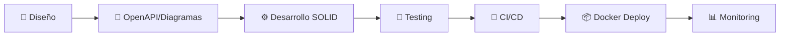

<div align="center">

# 👨‍💻 Erick Guerrón

### Estudiante de Ingeniería de Software
*Especializado en Desarrollo Web Full-Stack & Arquitecturas Contenerizadas*

<br>

<!-- Reemplaza esta URL con tu animación hosteada -->

<div align="center">
  <a href="https://erickguerron.github.io/" target="_blank">
    
  </a>
</div>


<br>

[](https://www.linkedin.com/in/erickguerron)
[](mailto:erickguerron@yahoo.com)
[](https://tu-dominio.com)

</div>

---

## 🎯 Sobre mí

```typescript
const developer = {
    nombre: "Erick Guerrón",
    ubicación: "Ecuador 🇪🇨",
    rol: "Software Engineering Student",
    enfoque: ["Clean Code", "API Design", "Containerization"],
    aprendiendo: ["MLOps", "OAuth/JWT Security", "Cloud Deployment"],
    filosofía: "Convertir ideas en productos bien diseñados y escalables"
};
```

Apasionado por el **desarrollo web moderno** y la **arquitectura de software**. Me especializo en construir aplicaciones robustas aplicando principios **SOLID**, **testing** y **CI/CD**. Actualmente profundizando en seguridad de APIs, contenedores y mejores prácticas de DevOps.

---

## 🚀 Proyectos Destacados

<table>
<tr>
<td width="50%">

### 📋 Gestor de Solicitudes
**Stack:** Nest.js • Angular • Docker • PostgreSQL

Sistema de gestión con autenticación JWT, control de roles y pipeline CI/CD automatizado.

🔹 Auth segura con Guards  
🔹 Documentación OpenAPI  
🔹 Docker multi-stage  
🔹 GitHub Actions CI

**[Ver Repositorio →](https://github.com/ErickGuerron/gestor-solicitudes)**

</td>
<td width="50%">

### 🛒 E-commerce Demo
**Stack:** React • TypeScript • Redux • Tailwind

Plataforma de comercio con gestión de estado avanzada y rutas protegidas.

🔹 Carrito persistente  
🔹 Testing con Jest/RTL  
🔹 Responsive design  
🔹 Optimización SEO

**[Ver Repositorio →](https://github.com/Mabe-Zapata/E-commerce-25-26)**

</td>

</tr>
<td width="50%">

### 🛒 App Predicion Climatica
**Stack:** Angular • TypeScript • OpenMeteo • Tailwind

Plataforma de prediccion climatica.

🔹 Calendario metereologico
🔹 Hora de cambio del clima 
🔹 Region disponible Riobamba

**[Ver Repositorio →](https://github.com/ErickGuerron/Probabilidad_Clima)**

</td>
<tr>
<td width="50%">

### 📚 API de Catálogos
**Stack:** Laravel • Sanctum • MySQL

RESTful API con autenticación, validación estricta y cache optimizado.

🔹 CRUD completo  
🔹 Paginación eficiente  
🔹 Rate limiting  
🔹 Logs de auditoría

**[Ver Repositorio →](https://github.com/ErickGuerron/Proyecto-Fundamentos)**

</td>
</tr>
</table>## 🚀 Proyectos Destacados

<table>
<tr>
<td width="50%">

### 📋 Heroes App
**Stack:** • Angular  

Sistema de gestión con autenticación JWT, control de roles y pipeline CI/CD automatizado.

🔹 Auth segura con Guards  
🔹 Uso de data de archivos .js
🔹 GitHub Actions CI

**[Ver Repositorio →](https://github.com/ErickGuerron/HeroesApp)**

</td>
<td width="50%">

### 🛒 E-commerce Demo
**Stack:** React • TypeScript • Tailwind

Plataforma de comercio con gestión de estado avanzada y rutas protegidas.

🔹 Carrito persistente  
🔹 Testing con Jest/RTL  
🔹 Responsive design  
🔹 Optimización SEO

**[Ver Repositorio →](https://github.com/Mabe-Zapata/E-commerce-25-26)**

</td>
</tr>

<tr>
<td width="50%">

### 🌤️ App Predicción Climática
**Stack:** Angular • TypeScript • OpenMeteo • Tailwind

Plataforma de predicción climática.

🔹 Calendario meteorológico  
🔹 Hora de cambio del clima  
🔹 Región disponible Riobamba

**[Ver Repositorio →](https://github.com/ErickGuerron/Probabilidad_Clima)**

</td>
<td width="50%">

### 📚 Plataforma Educativa
**Stack:** Laravel • Sanctum • MySQL

RESTful API con autenticación, validación estricta y cache optimizado.

🔹 CRUD completo  
🔹 Paginación eficiente  
🔹 Rate limiting  
🔹 Logs de auditoría

**[Ver Repositorio →](https://github.com/ErickGuerron/Proyecto-Fundamentos)**

</td>
</tr>
</table>

---

## 💼 Metodología de Trabajo

<div align="center">



</div>

<table align="center">
<tr>
<td align="center">
<strong>🎨 Diseño Primero</strong><br/>
Arquitectura y diagramas<br/>antes de código
</td>
<td align="center">
<strong>📋 Documentación</strong><br/>
OpenAPI/Swagger<br/>README detallados
</td>
<td align="center">
<strong>✅ Calidad</strong><br/>
SOLID • Clean Code<br/>Code Reviews
</td>
<td align="center">
<strong>🧪 Testing</strong><br/>
Unit • Integration<br/>E2E tests
</td>
<td align="center">
<strong>🔄 Automatización</strong><br/>
CI/CD pipelines<br/>Docker workflows
</td>
</tr>
</table>

---

## 🎓 Certificaciones

<div align="center">

| Certificación | Institución | Área |
|:-------------|:-----------|:-----|
| 🤖 **Fundamentos de IA Generativa** | Microsoft | Inteligencia Artificial |
| 🔒 **ISO/IEC 27001:2022** | ProGenios | Seguridad de la Información |
| 🐳 **Docker Essentials** | [DevTalles] | DevOps & Containers |

</div>

---

## 🛡️ Seguridad & Mejores Prácticas

<table>
<tr>
<td width="33%">

**🔐 Autenticación**
- JWT/Refresh tokens
- OAuth 2.0 flows
- Session management
- RBAC implementation

</td>
<td width="33%">

**🛡️ API Security**
- Input validation
- Rate limiting
- CORS policies
- Security headers
- Secrets management

</td>
<td width="33%">

**📋 Compliance**
- ISO 27001 principles
- OWASP Top 10
- Data encryption
- Audit logging
- Privacy by design

</td>
</tr>
</table>

---

## 📊 Estadísticas de GitHub

<div align="center">


</div>


---

## 🎓 Formación Académica

**Ingeniería de Software** — [Universidad/Institución]

**Áreas de Estudio:**
- Estructuras de Datos & Algoritmos
- Bases de Datos & Modelado
- Arquitectura de Software
- Redes & Protocolos
- Seguridad Informática
- DevOps & Cloud Computing

---

## 🛠️ Stack Tecnológico

### 💻 Lenguajes de Programación

<p align="center">


</p>

### 🎨 Frontend

<p align="center">


</p>

**🔧 PWA Development:** Service Workers • Cache Strategies • Offline Support • Web App Manifest

### ⚙️ Backend

<p align="center">


</p>

### 🗄️ Bases de Datos

<p align="center">


</p>

### 🔧 DevOps & Herramientas

<p align="center">


</p>

---

## 📫 Contacto

<div align="center">

### ¿Interesado en colaborar o conversar sobre tecnología?

[](https://www.linkedin.com/in/erickguerron)
[](mailto:erickguerron@yahoo.com)
[](https://tu-dominio.com)

---

<sub>💡 Siempre abierto a nuevos proyectos y oportunidades de aprendizaje</sub>

</div>

---

<div align="center">


**⭐ Si encuentras útil alguno de mis proyectos, considera darle una estrella ⭐**

</div>
